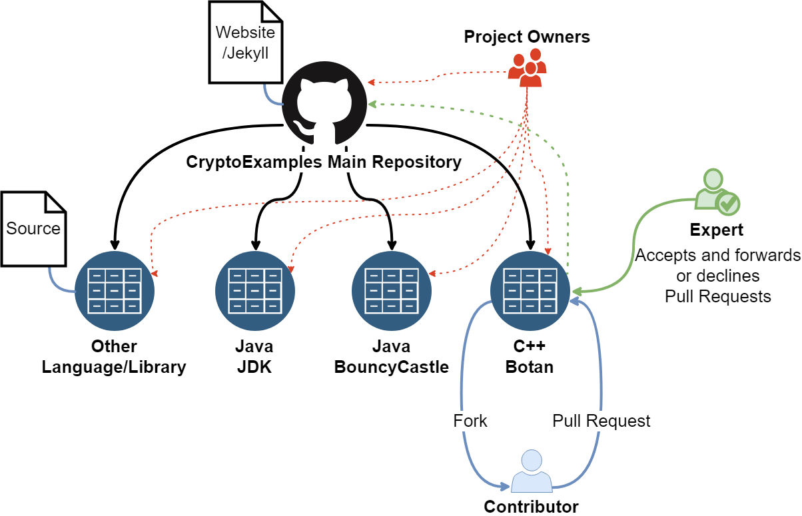

# Introduction

Many applications need cryptography. There are many examples in the web, that are either insecure or do not work right away. 
As programmers are usually not cryptography or security experts, they should be able to take the path of least resistance and not have to bother with all the decisions needed to make cryptography really secure.
The **crypto examples provided on this site meet current security and cryptography requirements**.
They demonstrate how cryptography can be used in many programming languages for common use cases like encrypting a String or a file using symmetric or asymmetric encryption. 

## Goals

- Minimal complete and secure code examples for common crypto scenarios
- Using only **standard library functionality** where possible (minimal)
- Using only **secure cryptographic functionality** (secure)
- Providing **copyable code** that can be used right away (complete)
- Working with the **latest stable release of the programming language** or compiler
- Indicating **reviewed code**
- Automatic **unit tests** for all code examples
- State the cryptographic threats that are mitigated in each example 
- State the cryptographic guarantees/features in each example

## Available examples
### Java
#### JDK

- [cryptoexamples/java-crypto-examples](https://github.com/cryptoexamples/java-crypto-examples)

#### [Keyczar](https://github.com/google/keyczar)

- [cryptoexamples/java-keyczar-crypto-examples](https://github.com/cryptoexamples/java-keyczar-crypto-examples)

# More about CryptoExamples
## Architecture

Actor | Description
--- | ---
Project Owner | Has owner rights of any given repositories, therefore he can decide who becomes an *expert*. By now this is restricted to the founder of CryptoExamples, [Kai Mindermann, M.Sc.](https://github.com/kmindi)
Expert | Is allowed to accept pull requests made by contributors to a specific examples' repository. To become an expert, feel free to contact any project owner and describe what makes you a security expert.
Contributor | Maybe you? Feel free to contribute awesome security examples in any field you feel comfortable with! Below you will see how easy it is to contribute.

## How to contribute?
There are two possible ways of contributing code. Either by contributing code to an already existing language/library, or by contributing an example to a completely new language/library.
Examples for a specific library always reside in their own repositories, which include all the necessary files for the examples to work and their descriptions. Therefore you do not need to clone the whole CryptoExamples project, it's okay to just clone the repository corresponding to the library you want to contribute to.

### (a) Contributing code to an existing language/library
1. **Fork and update** the repository corresponding to the library you wish to contribute code to. Fell free to update existing examples or create new ones.
2. Submit a **pull request** in the origin repository.
  * An *expert* will check all changes and accept, decline or request changes to your pull request.
  
### (b) Contributing code for a new library
1. Fork the [template project](https://github.com/cryptoexamples/template-java-crypto-examples)
2. Update it the way that it fits the needs of the language/library.
  * Feel free to update its structure as different languages use different folder structures and have different dependencies.
3. [Open an issue](https://github.com/kmindi/CryptoExamples/issues/new) in this main repository, linking to your project.
  * You might need to revise it if there are quality issues concerning the publication on CryptoExamples.
  * The project owner(s) will then include a copy of your project into CryptoExamples.
4. As soon as a copy of your project has been added to CryptoExamples, feel free to contribute any (more) code as in (a).

# Other

Theme based on http://idratherbewriting.com/documentation-theme-jekyll/
